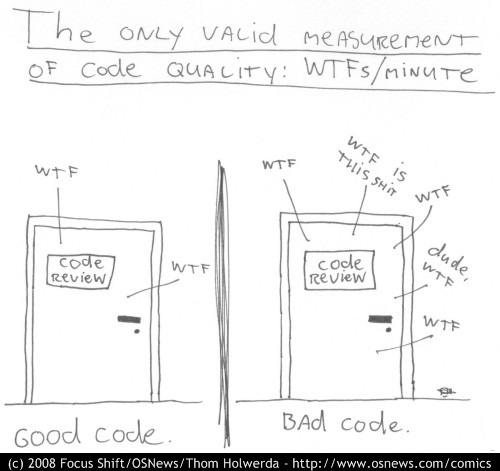

# Robert "Uncle Bob" C. Martin

::: columns

:::: column
{ width=100% }
::::

:::: column
- Geboren am 5. Dezember 1952

- Autor einiger Bücher zu den Themen Programmieren, Architektur und Design.

- Darunter das Buch "Clean Code: A Handbook of Agile Software Craftsmanship"
::::

:::

# Clean Code: A Handbook of Agile Software Craftsmanship

::: columns

:::: column
{ width=100% }
::::

:::: column
- Die Bibel dieses Workshops
::::

:::

# Was ist guter Code überhaupt?

{ width=65% }

# Und was ist schlechter Code?

```{.java .small}
ListItem<ListItem<T>> makeListOfLists(ListItem<T> flatList,
                PredicateWithException<T> predicate,
                boolean asClone) throws Exception {
  ListItem<ListItem<T>> listOfLists = new ListItem<>(), listOfListsTail = listOfLists;
  ListItem<T> listTail = null;
  int i = 0, j = 0;
  ListItem<T> pred = null, curr = flatList;
  while (curr != null) {
    if (predicate.test(curr.key, i, j)) { // current character is a sentinel
      // outer list is not empty
      listOfListsTail = listOfListsTail.next = new ListItem<>();
      if (!asClone && pred != null)
        pred.next = null;
      i++;
      j = 0;
      listTail = null;
    } else { // current character is not a sentinel
      ListItem<T> tailNew =
          asClone ? new ListItem<T>(curr.key) : curr;
      if (listTail == null)
        // inner list is empty
        listOfListsTail.key = listTail = tailNew;
      else
        listTail = listTail.next = tailNew;
      j++;
    }
    // update pointers
    pred = curr;
    curr = curr.next;
  }
  return listOfLists;
}
```

# Das muss doch besser gehen!

```{.java .small}
ListItem<ListItem<T>> makeListOfListsInPlace(
    ListItem<T> list,
    PredicateWithException<T> pred) throws Exception {
  var llist = new ListItemList<>(list);
  var res = new ListItemList<ListItem<T>>();

  int column = splitFirstRow(pred, llist, res);
  int row = 0;

  while (!llist.isEmpty()) {
    row = removeSeparator(pred, llist, column, row);
    column = splitRow(pred, llist, res, row);
  }

  return res.head;
}
```

# Da geht aber noch mehr...

```{.java .small}
ListItem<ListItem<T>> makeListOfListsInPlace(
    ListItem<T> list,
    PredicateWithException<T> pred) throws Exception {
  return new ListIntoLinesSplitter<>(list).splitOn(pred);
}
```

# Namen

{ width=65% }

# Funktionen

- Sind kurz

- Sind kürzer als das

- Tun eine Sache (auf einem Level der Abstraktion)

- Haben keine Nebeneffekte

# Kommentare

{ width=50% }

# Kommentare

## Ein nutzloses Kommentar

```java
/*
 * The setup function
 */
void setup() {
    // ...
}
```

## Das geht ohne sogar besser

```java
void restartGamestateAndRendering() {
    // ...
}
```

# Kommentare

## Warum das?

```{.java .small}
////// Changelog //////
//
// Daniel Mangold: Add tests and rubrics for H4.2 (2022-06-15)
// Daniel Mangold: Add tests and rubrics for H4.1 (2022-06-15)
// Oshgnacknak: Don't pass predefined identifiers to evaluate, only to nextStep (2022-06-14)
// Oshgnacknak: Hide ROOT and IDENTIFIERS behind getters (2022-06-13)
// Daniel Mangold: Add tests for H3.3 (2022-06-14)
// Daniel Mangold: Add tests for H3.2 (2022-06-13)
// Daniel Mangold: Fix grader-info.json (2022-06-13)
// Daniel Mangold: Add tests for H3.1 (2022-06-13)
// Oshgnacknak: Merge branch 'master' into tests (2022-06-13)
// Daniel Mangold: Fix module "grader" (2022-06-13)
```

## Es gibt `git log`

```{.small}
commit b58637c2d1f309aa28888512b21b35c47c8a40f4 (HEAD -> tests, origin/tests)
Author: Daniel Mangold <mangold.daniel@protonmail.com>
Date:   Thu Jun 16 17:43:29 2022 +0200

    Add tests for H4.2

commit 32053c8bd52f98572c307426be2ef19090df3f43
Author: Daniel Mangold <mangold.daniel@protonmail.com>
Date:   Thu Jun 16 17:35:29 2022 +0200

    Add tests for H4.1
```

# Kommentare

## Kommentiere nicht des Kommentars wegen

```java
/**
 * Returns the Authors ID
 *
 * @return the Authors ID
 */
void getAuthorId() {
    return authorId;
}
```

# Kommentare

## Niemals Code auskommentieren

```java
void sendMoney(Account reciever, BigDecimal amount) {
    // logger.logTransaction(this, reciever, amount);
    this.decreaseBalance(amount);
    reciever.increaseBalance(amount);
}
```

# Formatierung

{ width=80% }

# Error Handling

{ width=80% }

# Unit Tests

{ height=70% }

# Klassen

- Sind klein

- Sind kleiner als das

- SOLID Prinzipien

# SOLID Prinzipien

- **S**ingle Responsibility Principle

- **O**pen/Closed Principle

- **L**iskov’s Substitution Principle

- **I**nterface Segregation Principle

- **D**ependency Inversion Principle
